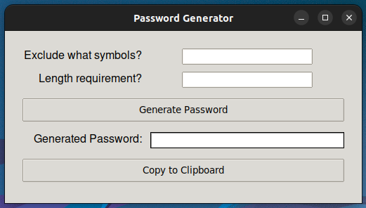

# Password Generator

This is a simple password generator application built with Python using the PyQt5 library for the graphical user interface (GUI). It allows users to generate secure passwords with customizable length and excluded symbols.

## Features

- Generate passwords with specified length and excluded symbols.
- Copy generated passwords to the clipboard with a single click.
- Visual feedback with a graphical user interface.

## Requirements and Dependencies

- Python 3.x
- PyQt5 (You can install it via pip)
- Pyperclip (You can install it via pip) 
```bash
pip install pyperclip
pip install PyQt5
```

## Usage

1. Clone the repository or download the script `password_generator.py`.
2. Make sure you have Python installed on your system.
3. Install the required dependencies.
4. Run the script: 
```bash
python password_generator.py
```
5. The graphical user interface will appear.



6. Enter symbols you want to exclude and the desired length of the password.
7. Click on the `Generate Password` button.
8. The generated password will be displayed in the text box.
9. You can copy the password by pushing the `Copy to Clipboard` button.

## Contributions

Contributions are welcome! If you find any issues or have suggestions for improvements, feel free to open an issue or create a pull request.
