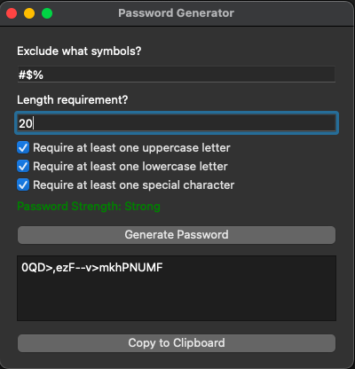

# Password Generator

This is a simple password generator application built with Python using the Tkinter library for the graphical user interface (GUI). It allows users to generate secure passwords with customizable length and excluded symbols.

## Features

- Generate passwords with specified length and excluded symbols.
- Copy generated passwords to the clipboard with a single click.
- Visual feedback with a graphical user interface.

## Requirements and Dependencies

- Python 3.x
- Tkinter (Usually comes pre-installed with Python)
- Dependencies listed in `requirements.txt`

## Installation

1. Clone the repository or download the files
2. Make sure you have Python installed on your system
3. Install the required dependencies:
```bash
pip install -r requirements.txt
```

## Usage

1. Run the script: 
```bash
python password_generator.py
```
2. The graphical user interface will appear.



3. Enter symbols you want to exclude and the desired length of the password.
4. Click on the `Generate Password` button.
5. The generated password will be displayed in the text box.
6. You can copy the password by pushing the `Copy to Clipboard` button.

## Contributions

Contributions are welcome! If you find any issues or have suggestions for improvements, feel free to open an issue or create a pull request.
